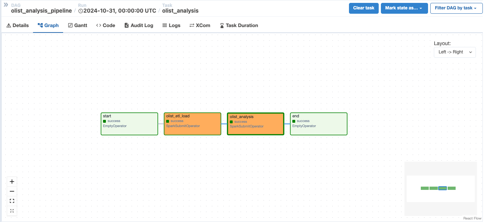
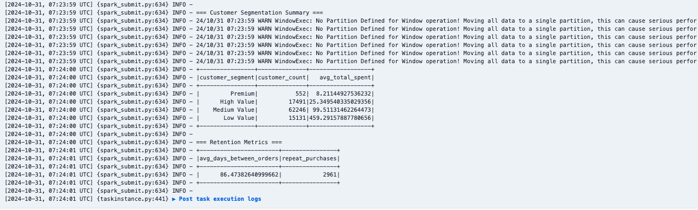

# Dibimbing, Data Engineering Bootcamp

1. Clone This Repo.
2. Run `make docker-build`

## List of Commands

```
## docker-build                 - Build Docker Images (amd64) including its inter-container network.
## docker-build-arm             - Build Docker Images (arm64) including its inter-container network.
## postgres                     - Run a Postgres container
## spark                        - Run a Spark cluster, rebuild the postgres container, then create the destination tables
## jupyter                      - Spinup jupyter notebook for testing and validation purposes.
## airflow                      - Spinup airflow scheduler and webserver.
## postgres-sql                 - Run psql in Postgres container
```

## Olist Customer Analysis Pipeline




This project includes an end-to-end ETL and analysis pipeline for the Olist e-commerce dataset. The pipeline consists of three main components:

### 1. ETL Process ([olist_etl_load.py](dibimbing_spark_batch_airflow/spark-scripts/olist_etl_load.py))

- Loads customer, order, and order items data from CSV files
- Processes and transforms timestamps and date formats
- Creates customer purchase summaries
- Writes both detailed and summary data to PostgreSQL tables:
  - `public.olist_customer_orders`
  - `public.olist_customer_summary`

### 2. Analysis Process ([olist_analysis.py](dibimbing_spark_batch_airflow/spark-scripts/olist_analysis.py))

- Performs advanced customer analysis including:
  - Customer Segmentation (Premium, High Value, Medium Value, Low Value)
  - Purchase Pattern Analysis
  - Customer Retention Metrics
- Outputs results to PostgreSQL tables:
  - `public.olist_customer_segments`
  - `public.olist_retention_metrics`

### 3. Airflow DAG ([olist_analysis_dag.py](dibimbing_spark_batch_airflow/dags/olist_analysis_dag.py))

- Orchestrates the entire pipeline
- Runs daily at midnight
- Includes retry logic and error handling
- Task sequence: start → ETL → Analysis → end

## Running the Pipeline

1. Ensure all required services are running:

```bash
make spark
make airflow
```

2. Access the Airflow web interface and enable the `olist_analysis_pipeline` DAG

3. The pipeline will automatically run daily, or you can trigger it manually through the Airflow UI

---

Reference from seceng with some improvement
